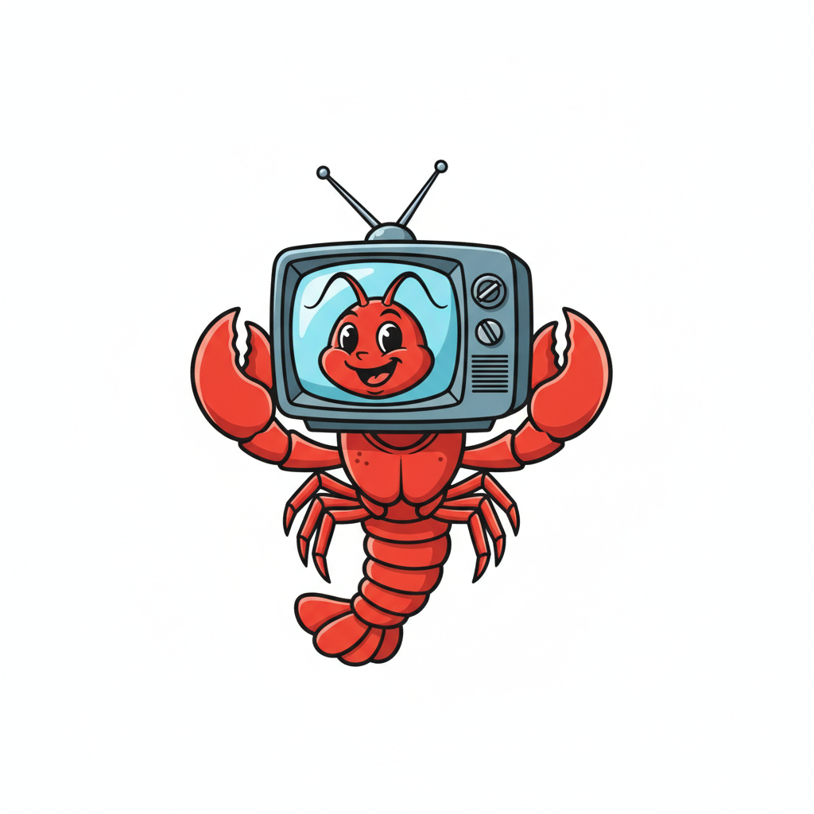
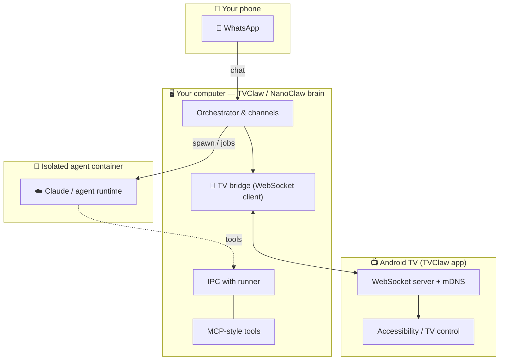

<p align="center">
  
</p>

<h1 align="center">TVClaw 📺🦞</h1>

<p align="center">
  <strong>TV</strong> meets <strong>claw</strong>: chat from WhatsApp/Telegram(soon) 💬, run the brain on your machine 🖥️, and drive the big screen with the Android TV/Apple TV(soon) 📺.
</p>

<p align="center">
  If this project is useful to you, please <a href="https://github.com/TVClaw/TVClaw">star ⭐️ the repo on GitHub</a> — it helps others discover it and keeps momentum up.
</p>

---

## One-line install (macOS / Linux)

```bash
curl -fsSL -H 'Accept: application/vnd.github.raw' 'https://api.github.com/repos/TVClaw/TVClaw/contents/install.sh?ref=main' -o /tmp/tvclaw-install.sh && bash /tmp/tvclaw-install.sh
```

Saving the script first avoids piping problems (some shells or `pipefail` settings) and makes GitHub errors visible instead of feeding JSON into Bash. You can use `| bash` instead if you prefer. `cdn.jsdelivr.net/gh/TVClaw/TVClaw@main/install.sh` can lag behind GitHub.

Requirements: **Docker running**, **Node 20+** (the installer can install Node on macOS with Homebrew), **git**.

Already cloned? From the **repository root**:

```bash
bash install.sh
```

**Windows:** use **WSL2** and run the same `curl` line inside Ubuntu on WSL.

### What the installer does 🛠️

- Sets up **Node.js 20+** (Homebrew on macOS when you allow it)
- Installs **NanoClaw** dependencies, builds TypeScript, and builds the **agent container** (Docker on typical macOS/Linux setups)
- Runs guided setup (timezone, mounts, container, optional background service, sanity checks)
- Helps you connect **OneCLI** and your **AI** credentials 🔑
- Walks through **WhatsApp** (QR in the terminal, optional browser QR) and **TVClaw** group setup
- Helps get the **Android APK** onto your TV (ADB or a LAN URL you can open from the TV)
- Adds the **`tvclaw`** CLI under `~/.local/bin` and opens the GitHub page so you can **star** the project ⭐️

## Installation

### Desktop installation

<video src="docs/videos/desktop-installation.mp4" controls playsinline width="100%"></video>

### Mobile installation

<video src="docs/videos/mobile-installation.mp4" controls playsinline width="100%"></video>

## Use-cases

### Netflix show

<video src="docs/videos/use-case-netflix.mp4" controls playsinline width="100%"></video>

### NBA summary

<video src="docs/videos/use-case-nba.mp4" controls playsinline width="100%"></video>

### Play games

<video src="docs/videos/use-case-tetris.mp4" controls playsinline width="100%"></video>

---

## Architecture (sketch) 🗺️

Roughly how the pieces fit together — your phone talks to the brain; the brain talks to sandboxed agents and to the TV over the LAN.



---

## Repository layout 📂

- **`nanoclaw2/`** — gateway (WhatsApp, agents, OneCLI); details in [nanoclaw2/README.md](nanoclaw2/README.md)
- **`TVClaw/apps/client-android/`** — Android TV / phone **TVClaw** client 📺

---

## Collaboration wanted 🤝

TVClaw is better with more eyes and more rooms. We’d love help with:

- **Real-world testing** on different Android TV devices and network setups 🏠
- **Issues and ideas** — rough edges in install, UX, and docs ✏️
- **Skills** — patterns that plug into NanoClaw-style workflows (channels, container skills, tooling)
- **Clarity** — making the “happy path” obvious for people who’ve never touched ADB or WhatsApp linking

If you’re not sure where to start, open a discussion or issue on GitHub and say hi 👋

---

## Upcoming work 🔭

Directions we’re excited about (no fixed timeline — watch the repo and **star ⭐️** it to follow along):

| Theme | Ideas |
|-------|--------|
| **More screens** | **Apple TV** support 🍎📺 |
| **Models** | **Local** open models (e.g. Gemma, Llama-class) 🦙 and **hosted** APIs (e.g. GPT, Gemini) 🤖 |
| **More chat apps** | **Telegram** and other messengers ✈️ |
| **Ecosystem** | **Future skills**, richer TV automation, smoother onboarding 🦞 |

---

<p align="center">
  <a href="https://github.com/TVClaw/TVClaw"><strong>TVClaw on GitHub</strong></a> — if you’re here anyway, tap ⭐️ <strong>Star</strong> and ride along.
</p>
